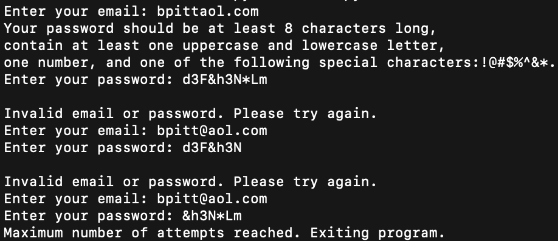
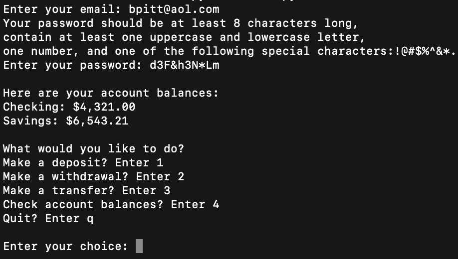
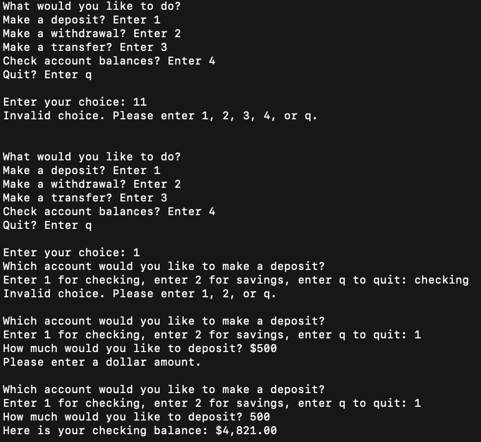

# extra_credit_22

 GIVEN A banking system
 WHEN I launch the program
 THEN I am prompted to enter my email and password for authentication
 WHEN I enter invalid login credentials
 THEN I am given up to three attempts to enter the correct credentials
 WHEN I enter valid login credentials
 THEN I am shown my checking and savings account balances
 THEN I am asked if I want to make a deposit, withdrawal, transfer, check my balances, or quit
 WHEN I select to make a deposit
 THEN I am asked to choose which account to make a deposit to
 WHEN I enter the deposit amount
 THEN the chosen account balance is updated and displayed
 WHEN I select an option to make a withdrawal
 THEN I am asked to choose which account to make a withdrawal from
 WHEN I enter the withdrawal amount
 THEN the chosen account balance is updated and displayed, and an error is shown if funds are insufficient
 WHEN I select an option to transfer funds
 THEN I am asked to choose which account to transfer from
 WHEN I enter the transfer amount
 THEN both account balances are updated and displayed, and an error is shown if funds are insufficient
 WHEN I select an option to check account balances
 THEN I am shown the current balances of both checking and savings accounts
 WHEN I choose to quit the program
 THEN the program exits

  
Mockups
  

 

  
